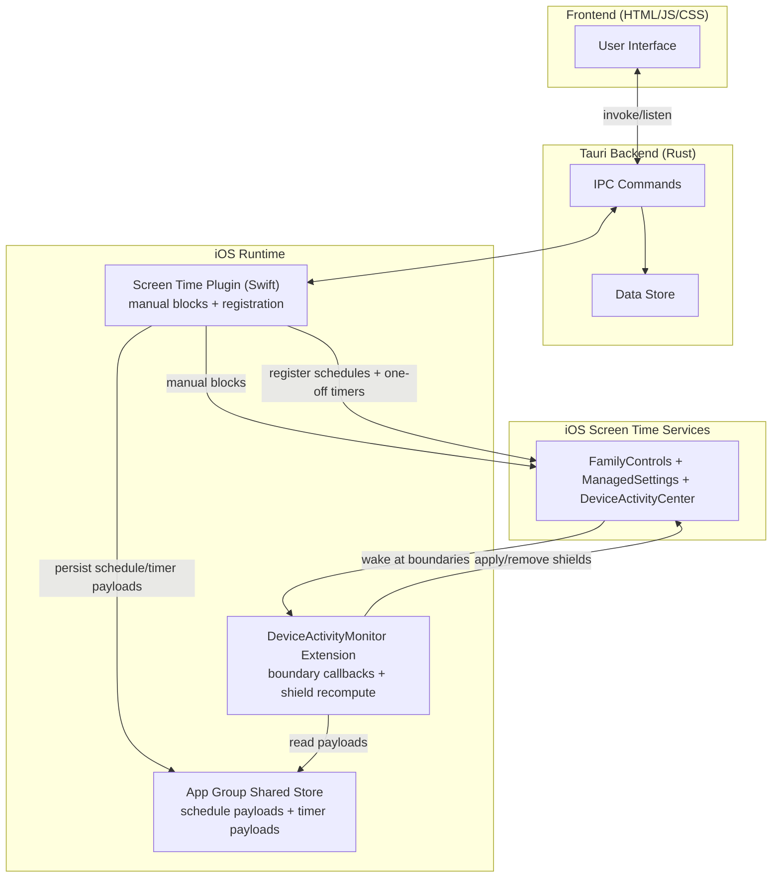

# ReDD Block

Block distracting websites and apps with scheduled or one-off blocks. Stay focused on what matters.

Built by computer scientists at the University of Oxford (Dr Ulrik Lyngs) and the University of Maastricht (Dr Konrad Kollnig), as part of the Reduce Digital Distraction project ([reddfocus.org](https://reddfocus.org)).

## Features

- **Cross-Platform** — Works on macOS, Windows, iOS (iPad/iPhone), and Android (source code for the Android version is here: https://github.com/kasnder/redd-block-android)
- **Website Blocking** — Browser extension + native-messaging host on desktop (Windows/macOS), Screen Time on iOS. Works in Chrome, Brave, Edge, and Firefox. On Windows the extension is silently force-installed and locked via user-scope browser policies; on macOS ReDD Block prompts the user to install the extension and the enforcement loop keeps it enabled.
- **App Blocking** — Automatically blocks distracting apps (minimizes/hides on desktop via the privileged helper daemon, Screen Time shield overlay on iOS)
- **Flexible Blocklists** — Create multiple lists with custom names, colors, and emojis
- **One-Off Blocks** — Quick blocks for immediate focus sessions
- **Scheduled Blocks** — Set recurring blocks on specific days/times (e.g., block social media Mon-Fri 9am-5pm)
- **Visual Calendar** — See all your scheduled and active blocks on an interactive weekly timeline
- **Override Protection** — Configurable typing challenges prevent impulsive unblocking
- **Background Operation** — Blocks continue even when the app is closed
- **Theme Options** — Auto, light, or dark mode

## Architecture

### Desktop (macOS / Windows)

Website blocking runs through the browser extension ([reddfocus-open-source](https://github.com/ulyngs/reddfocus-open-source)) using [native messaging](https://developer.chrome.com/docs/extensions/develop/concepts/native-messaging). The Tauri binary itself acts as the native host when launched with `--native-host` — no separate helper process for websites. App blocking still uses the privileged helper daemon.

```mermaid
flowchart TB
    subgraph Frontend["Frontend (HTML/JS/CSS)"]
        UI[User Interface]
    end

    subgraph Tauri["Tauri Backend (Rust)"]
        IPC[IPC Commands]
        Data["Data Store<br/>redd-block-data.json"]
        NativeHost["Native Messaging Host<br/>(same binary, --native-host)"]
        Enforcer["Extension Enforcer<br/>(background thread)"]
    end

    subgraph Browser["Browser + ReDD Focus Extension"]
        ExtBG[background.js]
    end

    subgraph Helper["Helper Daemon (Privileged)"]
        AppWatcher[App Watcher]
        State[Persisted App State]
    end

    subgraph System["System Resources"]
        Apps[Running Apps]
        Profiles[Browser Profiles]
    end

    UI <-->|invoke/listen| IPC
    IPC <-->|Unix socket (mac) / TCP (win)| Helper
    IPC --> Data
    Browser -->|launches on connect| NativeHost
    NativeHost -->|reads + watches| Data
    NativeHost -->|pushes blocklist| ExtBG
    ExtBG -->|redirects tabs to blocked.html| Browser
    AppWatcher -->|hide/minimize| Apps
    Enforcer -->|scans| Profiles
    Enforcer -.->|quit if extension disabled| Browser
```

Key flows:

- **Install time:** the Tauri app writes native-messaging manifests into each supported browser's user-scope location (JSON files on macOS, HKCU registry keys on Windows) and drops a small launcher shim that execs the Tauri binary with `--native-host`.
- **Install time (Windows only):** ReDD Block additionally writes `ExtensionInstallForcelist` / `ExtensionSettings` policy entries under `HKCU\Software\Policies\...`. Chrome, Brave, Edge, and Firefox honor those policies at startup: they silently fetch the ReDD Focus extension from the Web Store / AMO and lock it in place, so Windows users don't have to install the extension themselves and can't disable or remove it from the browser UI. Firefox additionally auto-grants private-window access via the same policy blob; on Chromium browsers "Allow in Incognito" is still a user toggle (the enforcement loop nags until it's on). No admin is required — everything is per-user HKCU. On macOS the equivalent path (managed preferences) needs `sudo`, so macOS users install the extension manually and the enforcement loop nags them to keep it enabled.
- **Every time a tab changes:** the extension compares the new URL against a blocklist pushed from the native host.
- **Blocklist updates:** the native host watches `redd-block-data.json` (+ 30 s poll for schedule edges), derives active domains, and pushes them to the extension over stdio.
- **Enforcement loop:** a background thread checks the extension's state across browsers; if the user disables it while blocks are active (or never enabled "Allow in Incognito" — which no policy can auto-grant on Chromium), ReDD Block nags and then quits the browser after a 30-second grace period.
- **Uninstall:** the reverse — manifests are removed, force-install policy entries are deleted, and ReDD Focus becomes removable through the regular browser UI again.

### iOS (iPad / iPhone)



## How It Works

### Website Blocking

**Desktop (macOS / Windows):** A privileged helper daemon modifies the system hosts file to redirect blocked domains to `0.0.0.0`. Blocks persist across app restarts and work in all browsers.

| Platform | Hosts File | Helper Location |
|----------|------------|-----------------|
| macOS | `/etc/hosts` | `/Library/PrivilegedHelperTools/com.redd.block.helper` (launchd daemon) |
| Windows | `C:\Windows\System32\drivers\etc\hosts` | Scheduled Task (runs at logon) |

**iOS:** Website blocking uses the Screen Time API's `WebContentSettings` to block domains at the OS level — no hosts file is involved. Users type in domains to block, and the app applies them via a `ManagedSettingsStore` shield.

### App Blocking

**Desktop (macOS / Windows):** The helper daemon uses event-driven monitoring to detect when blocked apps are launched or brought to focus, then immediately hides/minimizes them. App blocking persists even when the main app is closed.

**iOS:** App blocking uses the Screen Time API's `ManagedSettingsStore` to apply a shield overlay on selected apps and categories.

### Scheduled Blocking on iOS

Yes, scheduled blocking is technically supported on iOS. ReDD Block implements it through Apple's Screen Time stack:

- The app saves schedule payloads (domains/app/category tokens) in an App Group store.
- The app registers schedule windows with `DeviceActivityCenter`.
- At schedule boundaries, the system wakes the `DeviceActivityMonitor` extension (even when the app is closed), which reads the shared payloads and applies/removes shields via a named `ManagedSettingsStore`.
- Short iOS schedules still work, but under the hood they must respect Apple's 15-minute minimum `DeviceActivitySchedule` interval and use warning callbacks for the real end time.

This is why iOS scheduled blocking is possible without a desktop-style helper daemon.

| Platform | Detection Method | Hide Method |
|----------|------------------|-------------|
| macOS | NSWorkspace notifications (via helper daemon) | `set visible of application process to false` |
| Windows | SetWinEventHook for foreground changes (via helper daemon) | ShowWindow with SW_MINIMIZE |
| iOS | Screen Time `ManagedSettingsStore` | Shield overlay via `ShieldSettings` |

### Helper Daemon (Desktop Only)

Runs with elevated privileges to manage hosts file changes and app blocking. On first use, requests admin credentials once. After setup, blocks start instantly without prompts.

- **macOS**: Installed as a launchd daemon, authorized via password prompt
- **Windows**: Installed as a Scheduled Task with highest privileges, authorized via UAC prompt
- **Auto-upgrade**: If the helper is outdated when you start a block, the app prompts you to reinstall it (which upgrades it in place)
- **Repair/reinstall**: If the helper is installed but not running, starting a desktop block prompts a reinstall/repair flow before blocking begins
- **Troubleshooting**: If websites remain blocked after all blocks are stopped, use the "Clean hosts file" button in Settings → Advanced Options to remove stale entries
- **Diagnostics**: Settings → Diagnostics shows helper status/version, hosts file preview, helper state, and available log tails for troubleshooting

On iOS, the helper daemon is not used — blocking is handled entirely through the Screen Time API.

## Local Development

### Prerequisites

- [Node.js](https://nodejs.org/) (v18+)
- [Rust](https://www.rust-lang.org/tools/install) (latest stable)
- [Tauri CLI](https://tauri.app/start/prerequisites/)

**Windows additional requirements:**
- Visual Studio Build Tools with C++ workload

**iOS additional requirements:**
- Xcode 15+
- An Apple Developer account
- A physical iOS device (Screen Time APIs don't work in the simulator)

### Getting Started

```bash
# Clone the repository
git clone https://github.com/ulyngs/redd-block.git
cd redd-block

# Install dependencies
npm install

# Run in development mode (syncs helper and starts Tauri)
npm run dev

# Run on iOS device (opens Xcode, then press ⌘R to build)
npm run dev:ios
```

The app will open automatically. Hot-reloading is enabled for both frontend (Vite) and backend (Tauri).

### Building

```bash
# macOS: Universal binary (Intel + Apple Silicon) → DMG
npm run build:mac

# Windows: NSIS/MSI installers (x64 + ARM64)
npm run build:win

# iOS: Build IPA for App Store upload (via Transporter)
npm run build:ios
```

Built artifacts are copied to `for-distribution/` for upload or direct distribution.

### Testing

Testing is organized into three automated tiers plus a manual checklist:

**1. Unit Tests (in-app, instant)**

Tests blocking logic — time-based scenarios, overlaps, overrides, override-all state transitions, and challenge difficulty selection. No system modification.

```bash
npm run dev                   # Start the app
# Press Cmd+Shift+T (Mac) or Ctrl+Shift+T (Windows)
# Or type in the dev console: runBlockingTests()
```

**2. Integration Tests (in-app, profile-based)**

Creates real blocks using safe `.invalid` domains and verifies helper-backed enforcement through the real app -> Tauri -> helper path. The default `core` profile covers hosts modification, expiry, schedule activation, one-off pause/resume enforcement, overlap safety, scoped clear, and helper diagnostics/status parity. The `full` profile adds broader pause/schedule cases, extra clear semantics, app-command transport checks, and duplicate/max-difficulty paths. Requires the helper daemon to be running and can modify real desktop system state. See `testing.md` for the exact profile breakdown.

```bash
# In the dev console:
runIntegrationTests('core')   # default, faster critical checks
runIntegrationTests('full')   # core + expanded non-UI coverage
```

**3. Helper Daemon Smoke Test (terminal)**

Talks directly to the helper daemon via IPC — verifies ping, version, start block → hosts file check → clear block → cleanup → localhost safety.

```bash
# macOS
sudo ./scripts/test-helper-mac.sh

# Windows (PowerShell as admin)
.\scripts\test-helper-win.ps1

# Or cross-platform via npm
npm run test:helper
```

**4. Manual Checklist**

See `scripts/manual-test-checklist.md` for the full pre-release checklist including advanced settings (override all, clean hosts, keep-blocking-on-uninstall), helper lifecycle (install/upgrade/remove), and iOS-specific tests.

## Project Structure

```
redd-block/
├── src/                          # Frontend (HTML/JS/CSS)
│   ├── index.html                # Main app layout
│   ├── app.js                    # App logic & UI
│   └── styles.css                # Styling
├── src-tauri/                    # Tauri backend (Rust)
│   ├── src/
│   │   ├── lib.rs                # App setup & window config
│   │   └── commands/             # IPC commands
│   ├── gen/apple/                # Generated Xcode project
│   ├── tauri.conf.json           # Shared Tauri config
│   ├── tauri.ios.conf.json       # iOS-specific config
│   ├── tauri.macos.conf.json     # macOS-specific config
│   └── tauri.windows.conf.json   # Windows-specific config
├── tauri-plugin-screentime/      # iOS Screen Time plugin
│   ├── ios/Sources/              # Swift plugin (FamilyActivityPicker, ManagedSettings)
│   ├── src/                      # Rust bindings (commands, models, mobile/desktop)
│   └── permissions/              # Plugin permissions
├── helper-daemon/                # Privileged helper (Rust, desktop only)
│   └── src/main.rs               # Hosts file, app watching, schedules
├── scripts/                      # Build, signing, and dev scripts
├── docs/                         # GitHub Pages (version info for reddfocus.org, App Store privacy policy)
└── vite.config.js                # Vite dev server config
```

## Version Management

The app and helper daemon are versioned independently:

| Component | Version Location |
|-----------|------------------|
| **App** | `package.json`, `src-tauri/tauri.conf.json`, `src-tauri/Cargo.toml` |
| **Helper daemon** | `helper-daemon/Cargo.toml` |
| **Expected helper version** | `src-tauri/src/commands/helper.rs` → `EXPECTED_HELPER_VERSION` |
| **Published versions** | `docs/latest-versions.json` (macOS, Windows, iOS) |

Use `./scripts/bump-version.sh <version>` to update the app and helper version in all files at once. When updating the helper daemon independently, also update `EXPECTED_HELPER_VERSION` in `helper.rs` to match.

This separation avoids prompting users to reinstall the helper when only the app changes.

## Data Storage

### App Data

Desktop app data can exist in both a legacy per-user location and a shared system-wide location. Once the shared location becomes active, the app continues to prefer it so reinstall/uninstall flows do not silently flip storage location.

| Platform | Legacy per-user location | Shared desktop location |
|----------|--------------------------|-------------------------|
| macOS | `~/Library/Application Support/com.redd.block/redd-block-data.json` | `/var/lib/redd-block/redd-block-data.json` |
| Windows | `%AppData%\com.redd.block\redd-block-data.json` | `C:\ProgramData\ReDD Block\redd-block-data.json` |
| iOS | App sandbox (managed by Tauri) | N/A |

Contains blocklists, schedules, active blocks, and settings.

### Helper State

| Platform | Location |
|----------|----------|
| macOS | `/var/lib/redd-block/helper-state.json` |
| Windows | `C:\ProgramData\ReDD Block\helper-state.json` |
| iOS | N/A (uses Screen Time API) |

Tracks blocking state so blocks persist across app restarts.

### Uninstall Behavior

User data is preserved unless manually deleted. On desktop, reinstalling typically restores blocklists and settings automatically from the active app-data location (shared if already adopted, otherwise legacy per-user storage).

The helper daemon checks every 5 minutes whether the main app is still installed. If the app is no longer detected:
- **"Keep blocking running if app is uninstalled" is ON (default):** The helper keeps running as long as any one-off blocks, app blocks, or schedules are active. Once they all finish, it cleans up and removes itself.
- **"Keep blocking running if app is uninstalled" is OFF:** The helper immediately cleans up (restores the hosts file, clears state) and removes itself.

### Desktop Development Caveat

Local desktop dev builds and installed release builds currently talk to the same machine-global helper installation and helper state on a given machine.

This means:

- a local `npm run dev` session can see a helper installed by a release build,
- reinstall/uninstall observations can be affected by stale helper state or logs from another build,
- helper lifecycle debugging is clearest on a clean machine or VM.

## Requirements

- **macOS**: 10.15+ (Catalina or later)
- **Windows**: 10+ (version 1809 or later)
- **iOS**: 16.0+ (iPhone and iPad)
- **Android**: see https://github.com/kasnder/redd-block-android
- **Linux**: Coming soon

## Tech Debt

- **Rename `updateHostsFile()`**: This function is misleadingly named. On desktop it updates the hosts file (website blocking only), but on iOS it dispatches to the Screen Time API and handles *both* website and app blocking (`screentimeStartBlock`/`screentimeClearBlock`). Meanwhile, `updateBlockedApps()` returns immediately on iOS (`if (isIOS) return`). Consider renaming `updateHostsFile()` to something like `syncWebsiteBlocking()` or splitting the iOS Screen Time logic into its own function that clearly handles both websites and apps.

## License

CC-BY-NC-ND-3.0

---

Made with ♥ by [reddfocus.org](https://reddfocus.org)
