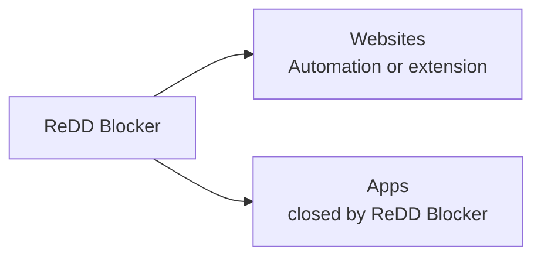

# ReDD Blocker: Space for Focus

Block distracting websites and apps with scheduled or one-off blocks and customisable difficulty to override. Stay focused on what matters.

Built by computer scientists at the University of Oxford (Dr Ulrik Lyngs) and the University of Maastricht (Dr Konrad Kollnig), as part of the Reduce Digital Distraction project ([digitalhabits.org](https://digitalhabits.org)).

## Features

- **Cross-Platform** — Works on macOS 11+, Windows 10+, iOS (iPad/iPhone), and Android from the same Tauri UI codebase.
- **Website Blocking** — ReDD Blocker decides what to block. On **macOS**, Safari/Chrome/Brave/Edge use **Automation** (no extension); **Firefox** and **Waterfox** use the ReDD Focus extension. On **Windows**, Chrome/Brave/Edge/Firefox/Waterfox use the extension. On **iOS**, blocking uses Screen Time. On **Android**, blocking is enforced by the native AccessibilityService plugin.
- **App Blocking** — Closes distracting apps on desktop (warning overlay → save window → polite quit → force-close if needed), uses Screen Time shield overlays on iOS, and uses the Android AccessibilityService/friction gate on Android.
- **Flexible Blocklists** — Create multiple lists with custom names, colors, and emojis
- **One-Off Blocks** — Quick blocks for immediate focus sessions
- **Scheduled Blocks** — Set recurring blocks on specific days/times (e.g., block social media Mon-Fri 9am-5pm)
- **Visual Calendar** — See all your scheduled and active blocks on an interactive weekly timeline
- **Override Protection** — Configurable typing challenges prevent impulsive unblocking
- **Background Operation** — Blocks continue even when the app is closed
- **Theme Options** — Auto, light, or dark mode

## How it works

> **v3 (current).** ReDD Blocker is a single unprivileged app — no helper daemon, no `hosts` file writes. On **macOS**, Safari/Chrome/Brave/Edge website blocking uses **Automation** (Apple Events); **Firefox** and **Waterfox** still use the ReDD Focus extension. On **Windows**, all supported browsers use the extension. macOS may ask for your password **once** when cleaning up leftover v1.x components.

ReDD Blocker is **one app**. When you start a block, it does two things:

| | What gets blocked | Who does the blocking (desktop) |
|---|-------------------|----------------------------------|
| **Websites** | URLs in your blocklists | **macOS:** Automation for Safari/Chrome/Brave/Edge; ReDD Focus extension for Firefox and Waterfox. **Windows:** ReDD Focus extension |
| **Apps** | Programs in your blocklists | **ReDD Blocker** — closes them for you |



### Website blocking (desktop)

**ReDD Blocker** stores your blocklists and enforces them. macOS and Windows use different plumbing — see the tables below.

**macOS**

| Browser | How blocking works | Extension setup |
|---------|-------------------|-----------------|
| Safari, Chrome, Brave, Edge | **Automation** (Apple Events) — ReDD Blocker redirects blocked tabs | ReDD Blocker prompts for Automation in System Settings → Privacy & Security → Automation |
| Firefox | ReDD Focus extension | Install manually from the [Firefox Add-ons store](https://addons.mozilla.org/) — ReDD Blocker does **not** auto-install on macOS |
| Waterfox | ReDD Focus extension | Install manually from the [Firefox Add-ons store](https://addons.mozilla.org/) — ReDD Blocker does **not** auto-install on macOS |

**Windows**

| Browser | How blocking works | Extension setup |
|---------|-------------------|-----------------|
| Chrome, Brave, Edge, Firefox, Waterfox | Native messaging (stdio) — the extension wakes ReDD Blocker in the background to fetch the blocklist | ReDD Blocker can auto-install extension hints where supported |

**How native messaging works (Windows)**

1. The extension needs the current blocklist.
2. The browser **cannot read ReDD Blocker's window**, so it wakes up ReDD Blocker **in the background** — same app you installed, **no new window appears**.
3. ReDD Blocker sends the list to the extension and exits.
4. The extension blocks matching sites.

You never open anything extra or run a second program. It's just how Chrome/Firefox talk to local apps.

While a block is active, ReDD Blocker can warn you or quit browsers if website blocking stops working (e.g. Automation denied on Safari/Chrome, or the Firefox extension disabled).

### App blocking (desktop)

| Step | What happens |
|------|----------------|
| 1 | **"Let's go!"** warning — you click when ready |
| 2 | **30 seconds** to save work and quit on your own |
| 3 | ReDD Blocker asks the app to close politely |
| 4 | Still open after **10 seconds**? Force-closed |

If you **open** a blocked app mid-block, ReDD Blocker skips the warning and closes it on the fast path.

ReDD Blocker runs from the menu bar / system tray and can start at login so blocking continues across sessions.

### iOS

No browser extension — ReDD Blocker uses **Screen Time** to shield websites and apps. Scheduled blocks work via a background monitor extension even when the app is closed. Details: [architecture.md](architecture.md).

### Android

Android uses the shared Tauri webview UI plus a local Android plugin. The plugin keeps the enforcement work in Kotlin/Java Android components: an AccessibilityService applies the block/friction gate, WorkManager handles schedule transitions, and Rust only exposes the Tauri command bridge used by the UI.

You can open `src-tauri/gen/android/` in Android Studio to inspect, run, and build the generated project. Android Studio is still building the Tauri Android app: the Gradle project invokes the Tauri/Rust build steps and packages the shared frontend assets together with the native Android plugin. Two things are required for builds from Android Studio to work:

1. **Keep the Tauri CLI running** in a terminal while you build: `npm run tauri -- android dev --open`. The Gradle Rust task calls back into this process to fetch its build options; without it the build fails with a "failed to read CLI options" panic.
2. **`node`/`npm` and `cargo` must be on Gradle's PATH.** Android Studio launched from the Dock doesn't inherit your shell PATH, so `buildSrc/.../BuildTask.kt` is patched to prepend the nvm, cargo, and Homebrew bin directories. Note that re-running `tauri android init` regenerates that file and drops the patch — alternatively, launch Android Studio from a terminal (`open -a "Android Studio"`), which inherits your shell PATH.

### Permissions (desktop)

- **Extensions:** install ReDD Focus in Firefox and Waterfox (macOS) or in each browser you use on Windows.
- **macOS — Automation:** Safari, Chrome, Brave, and Edge need **Automation** permission so ReDD Blocker can redirect blocked tabs. ReDD Blocker walks you through this during setup; no Full Disk Access is required.
- **macOS — Firefox/Waterfox:** install ReDD Focus manually from the Add-ons store and allow it in private windows.
- **No** admin or UAC prompt at install time (macOS may ask once when cleaning up leftover v1.x components).

### Upgrading from v1.x

If you previously ran ReDD Blocker, **Fristed**, or ReDD Block 1.x (helper daemon + hosts file), the first launch after upgrade:

1. Cleans up the old hosts-file entries and helper daemon (macOS may ask for your password once).
2. Registers launch-at-login and (on Windows) native-messaging manifests for the extension.
3. Walks you through browser setup — Automation for Safari/Chrome/Brave/Edge on macOS; ReDD Focus extension on Windows and for Firefox on macOS.

### Developers

Implementation details and module map: [architecture.md](architecture.md) (v3 current; v2/v1 historical). The [browser-ext-migration/](browser-ext-migration/) folder documents the v2 extension architecture — still accurate for **Windows**; macOS website blocking moved to Automation in v3.

## Local Development

### Prerequisites

- [Node.js](https://nodejs.org/) (v18+)
- [Rust](https://www.rust-lang.org/tools/install) (latest stable)
- [Tauri CLI](https://tauri.app/start/prerequisites/)

**Windows additional requirements:**
- Visual Studio Build Tools with C++ workload

**iOS additional requirements:**
- Xcode 15+
- An Apple Developer account
- A physical iOS device (Screen Time APIs don't work in the simulator)

**Android additional requirements:**
- Android Studio with Android SDK, platform-tools, and NDK installed
- A configured emulator or physical Android device (`adb devices` should show it)
- Tauri Android prerequisites installed for the Rust targets used by your device/emulator

### Getting Started

```bash
# Clone the repository
git clone https://github.com/ulyngs/redd-block.git
cd redd-block

# Install dependencies
npm install

# Run in development mode
npm run dev

# Run on iOS device (opens Xcode, then press ⌘R to build)
npm run dev:ios

# Run on Android emulator/device
npm run dev:android
```

The app will open automatically. Hot-reloading is enabled for both frontend (Vite) and backend (Tauri).

On Android, enable ReDD Block in Android Settings -> Accessibility after the
first install.

### Building

```bash
# macOS: Universal binary (Intel + Apple Silicon) → .app
npm run build:mac

# macOS: Wrap the .app into a signed/notarized .pkg installer
# (outputs redd-blocker-{version}.pkg)
npm run build:mac-pkg

# macOS: Both in one go (.app + .pkg)
npm run build:mac-all

# Windows: NSIS/MSI installers (x64 + ARM64) — direct download / S3
npm run build:win

# Windows: Microsoft Store (MSIX for Partner Center upload; same pipeline as redd-do)
npm run build:win-store

# iOS: Build IPA for App Store upload (via Transporter)
npm run build:ios

# Android: Build through Tauri/Gradle (release; unsigned)
npm run build:android
```

For Android — required environment variables (`ANDROID_HOME`/`NDK_HOME`/`JAVA_HOME`,
not set by `npm install`), debug-APK builds, single-ABI targeting, and the
install/`adb logcat` loop — see [docs/android-build.md](docs/android-build.md).

For Store builds, set `WINDOWS_IDENTITY_NAME` and `WINDOWS_PUBLISHER` in `.env` (Partner Center → Product identity) and upload the `.msix` from `for-distribution/x86_64-pc-windows-msvc/`. Run `node scripts/generate-icons-from-svg.js` first if `assets/icons/1024x1024.png` is missing.

**Local sideload:** `build:win-store` MSIX files are unsigned (Partner Center signs on upload). Sign and install in an **elevated** PowerShell (cert goes in `LocalMachine\TrustedPeople`):

```powershell
npm run sign:win-store-msix -- -MsixPath "for-distribution/aarch64-pc-windows-msvc/ReDD_Block_3.1.5.0_arm64.msix" -Install
```

Also turn on **Settings → System → For developers → Developer Mode**. If `0x800B0109` persists, remove old packages first: `Get-AppxPackage *ReDDBlock* | Remove-AppxPackage`.

Built artifacts are copied to `for-distribution/` for upload or direct distribution.

### Testing

Testing is organized into two automated tiers plus a manual checklist (see [testing.md](testing.md)):

**1. Unit Tests (in-app, instant)**

Tests blocking logic — time-based scenarios, overlaps, overrides, override-all state transitions, and challenge difficulty selection. No system modification.

```bash
npm run dev                   # Start the app
# Press Cmd+Shift+T (Mac) or Ctrl+Shift+T (Windows)
# Or type in the dev console: runBlockingTests()
```

**2. Integration Tests (in-app, profile-based)**

Creates real blocks using safe `.invalid` domains and exercises app → Tauri command paths (save, pause/resume, scoped clear, app-blocking commands, migration hosts cleanup). Does **not** fully prove website blocking on v3 — use the manual checklist for Automation redirects and extension enforcement.

```bash
# In the dev console:
runIntegrationTests('core')   # default, faster critical checks
runIntegrationTests('full')   # core + expanded non-UI coverage
```

**3. Manual Checklist**

See `scripts/manual-test-checklist.md` for the full pre-release checklist. Key items: macOS Automation setup + enforcer (Safari/Chrome/Brave/Edge), Firefox/Windows extension install, hide-on-close + launch-at-login, v1.x migration cleanup, Screen Time (iOS).

## Project Structure

```
redd-block/
├── src/                          # Frontend (HTML/JS/CSS)
│   ├── index.html                # Main app layout
│   ├── app.js                    # App logic & UI
│   └── styles.css                # Styling
├── src-tauri/                    # Tauri backend (Rust)
│   ├── src/
│   │   ├── lib.rs                # App setup, tray, hide-on-close, autostart
│   │   ├── app_watcher.rs        # In-process app watcher (sysinfo poll + quit)
│   │   ├── enforcer.rs           # Compliance enforcer (Automation TCC on macOS Safari/Chromium; extension elsewhere)
│   │   ├── web_automation.rs     # macOS Automation tab blocking (Safari, Chrome, Brave, Edge)
│   │   ├── native_host.rs        # Headless native-messaging host (Windows / Firefox blocklist feed)
│   │   ├── native_host_install.rs # Registers native-messaging manifests (Windows; skipped on macOS)
│   │   ├── profile_scan.rs       # Reads browser profile files
│   │   └── commands/             # IPC commands (data, apps, migration, …)
│   ├── blocked/                  # Block page bundled for macOS Automation redirects
│   ├── entitlements.macos.plist  # macOS Automation (Apple Events) entitlement
│   ├── gen/apple/                # Generated Xcode project
│   ├── gen/android/              # Generated Android project (committed)
│   ├── tauri.conf.json           # Shared Tauri config
│   ├── tauri.android.conf.json   # Android-specific config
│   ├── tauri.ios.conf.json       # iOS-specific config
│   ├── tauri.macos.conf.json     # macOS-specific config
│   └── tauri.windows.conf.json   # Windows-specific config
├── tauri-plugin-screentime/      # iOS Screen Time plugin
│   ├── ios/Sources/              # Swift plugin (FamilyActivityPicker, ManagedSettings)
│   ├── src/                      # Rust bindings
│   └── permissions/              # Plugin permissions
├── tauri-plugin-android-blocker/ # Android AccessibilityService blocking plugin
│   ├── android/                  # Kotlin plugin + BlockerService + schedules
│   ├── src/                      # Rust bindings
│   └── permissions/              # Plugin permissions
├── browser-ext-migration/
│   ├── MIGRATION_PLAN.md         # Rollout plan + remaining-work checklist
│   ├── FUTURE_OPTIONS.md         # Parked localhost fallback + signed .pkg notes
├── scripts/                      # Build/signing (build-mac.sh, build-mac-pkg.sh, …)
├── docs/                         # GitHub Pages (version info, App Store privacy policy)
└── vite.config.js                # Vite dev server config
```

## Version Management

| Component | Version Location |
|-----------|------------------|
| **App** | `package.json`, `src-tauri/tauri.conf.json`, `src-tauri/tauri.android.conf.json`, `src-tauri/Cargo.toml` |
| **Published versions** | `docs/latest-versions.json` (macOS, Windows, iOS, Android, plus `sha256.macosPkg` and `sizeBytes.macosPkg` for in-app macOS updates) |

Use `./scripts/bump-version.sh <version>` to update the app version in all files at once.

## Data Storage

### App Data

| Platform | Canonical location (once activated) | Per-user fallback |
|----------|-------------------------------------|-------------------|
| macOS | `/var/lib/redd-block/redd-block-data.json` | `~/Library/Application Support/com.reddblock/redd-block-data.json` |
| Windows | `%PROGRAMDATA%\ReDD Blocker\redd-block-data.json` (legacy: `%PROGRAMDATA%\Fristed\...`, `%PROGRAMDATA%\ReDD Block\...`) | `%AppData%\com.reddblock\redd-block-data.json` |
| iOS | App sandbox (managed by Tauri) | — |
| Android | App sandbox (managed by Tauri; native schedule mirrors managed by the Android plugin) | — |

Legacy v1 paths under `com.redd.block` are still read as a fallback during migration.

Contains blocklists, schedules, active blocks, and settings.

On **Windows** and **macOS Firefox**, the native-messaging host re-reads this file to derive the current blocklist. On **macOS Safari/Chrome/Brave/Edge**, the Automation watcher reads the same file via `derive_payload()`.

### Uninstall Behavior

User data is preserved unless manually deleted. Uninstalling the app also removes:

- the launch-at-login / login-item entry registered by `tauri-plugin-autostart`,
- the native-messaging manifests and registry keys (Windows) written by `install_native_host` (macOS uses Automation instead and does not auto-write Firefox manifests).

Active blocks stop firing once the app is gone because the app itself is now the enforcement engine. A paid-for-itself "keep blocking after uninstall" mode is no longer provided.

## Requirements

- **macOS**: 11.0+ (Big Sur or later) — Automation-based website blocking for Safari and Chromium browsers
- **Windows**: 10+ (version 1809 or later)
- **iOS**: 16.0+ (iPhone and iPad)
- **Android**: 8.0+ / API 26+
- **Linux**: Coming soon

## Tech Debt

- **Rename `updateHostsFile()`**: misleading now that no platform writes a hosts file for blocking. Consider renaming to `syncWebsiteBlocking()`.
- **Rewrite Tier 2 integration tests** (`src/integration-tests.js`): hosts-file assertions are v1-era; update to validate v3 enforcement paths.
- **Frontend still calls legacy `*_via_helper` commands** via the shim in `src-tauri/src/commands/helper_shim.rs`. Rewrite `src/app.js` to call modern command names directly and delete the shim.
